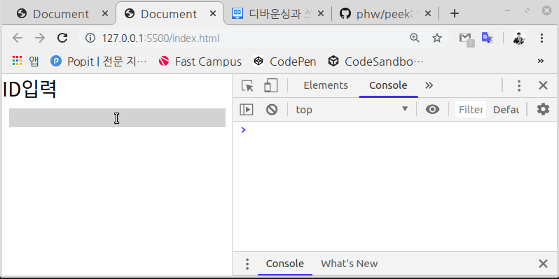
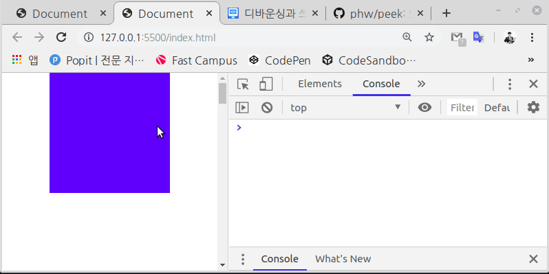

누르면 폭죽이 발사되는 버튼이 있다고 가정해보자.
폭죽 한 발을 쏘는데는 100만원의 비용이 든다.

폭죽이 워낙 화려한 폭죽이라 한 번 쏠때마다 값이 비싸기도 하고,
한 번 터지면 적어도 3초간은 하늘을 화려하게 불빛으로 수놓는다.

따라서 화려한 3초 동안에는 새로운 폭죽은 사족만이 될 뿐이다.

## 이벤트로 생각해보자

위 예에서 폭죽 발사 버튼을 누르는 것을 하나의 이벤트라고 생각해보자.
폭죽을 쏘는 비용은 해당 이벤트에 연결된 핸들러가 실행될 때 걸리는 연산량 혹은 메모리 사용량이 부하되는 정도라고 볼 수 있다.

디바운싱과 쓰로틀링은 필요이상으로 과도하게 반복되는 이벤트로 인한 부하를 완충하는 방법이다.

## 디바운싱과 쓰로틀링의 개념과 차이

비슷한 목적을 가지고 있으나, 작동 방식이 미묘하게 다르다.
처음 보면 충분히 헷갈릴 수 있을 정도로 묘한 차이이기 때문에 차근차근 짚어보는 것이 좋을 것 같다.

그럼 다시 서론에서 이야기한 폭죽 발사 버튼의 예를 활용해 개념과 차이를 서술해보겠다.
비싼 폭죽을 최대한 아끼면서 화려한 불꽃놀이를 위해 버튼에 무슨 작업을 해야할 것인가..?

### 디바운싱

3초의 시간을 설정해두고,
3초 내에는 버튼이 눌려도 폭죽이 발사되지 않도록 조정해두었다.

마구 연타시 폭죽은 발사되지 않고 마지막 버튼을 떼는 순간 3초 뒤 발사된다.

### 쓰로틀링

일단 버튼이 눌리면 3초간 먹통이 된다.
그리고 3초 후에는 다시 폭죽이 발사되도록 초기화가 된다.

이제 버튼을 마구 연타를 해도 3초의 발사 간격을 보장해준다.

### 차이

똑같이 3초의 시간을 설정해두고, 버튼을 쉼없이 연타한다고 가정해보자.

디바운싱의 경우 버튼을 누르는 동작이 3초내에 계속 반복될 경우,
이벤트는 절대 실행되지 않는다.

특정 시간내에 반복되는 동작은 그 동작이 다 마칠 때까지 일단 무시하는 것이다.
‘아무 동작없이 3초가 흘렀다’라는 것을 어떤 목적을 가진 연속된 동작이 마무리된 것으로 간주하는 것이다.

반면, 쓰로틀링의 경우 일단 3초라는 시간이 지나면, 대기가 풀려 다시 이벤트를 처리할 수 있게 된다.

곧, 연속되는 이벤트의 경우 3초 단위로 반드시 실행이 되는 것이다.

## 용도

용도는 역시 쓰기 나름일 것이다.
개념을 이해하면 그때그때 맞는 녀석을 골라서 쓰면 될 것이다.

쉽게 생각할 수 있는 기본적인 예들만 살펴보도록 하자.

### 디바운싱 - ID 중복검사

예를 들어 회원가입 폼에서 ID 입력상자에 어떤 id를 입력하면,
입력된 값을 서버로 요청을 보내 중복여부를 확인받는 이벤트 핸들러가 있다고 가정해보자.

한 자 한 자 타이핑하는 동안 줄곧 서버로 요청을 보낸다면 10글자 짜리 id를 쓰는데 10번의 요청이 발송될 것이다.

하지만 여기에 한 2초 정도의 디바운싱만 적용을 하여도,
한 번의 타이핑이 완료된 이후에 확인 요청을 보내도록 만들 수 있을 것이다.

### 쓰로틀링 - 스크롤 이벤트

보통 웹 서핑을 할 때 스크롤은 그냥저냥 휙휙 넘기는 녀석이다.
경우에 따라 다르겠지만, 마우스 휠 한 번을 굴리는데 스크롤 이벤트가 십수회 발생한다.

사실 스크롤 이벤트라는게 그렇게 정교하지 않아도 유저 경험에는 크게 지장이 없다.

스크롤을 통해 측량 작업을 하는 것이 아니기에,
일반적인 목적이라면 1초 혹은 0.5초씩 처리를 해도 특별히 불편한 점이 없는 것이다.

## 구현

아래의 두 함수는 특정 이벤트 핸들러를 인자로 받아 디바운싱과 쓰로틀링 기능을 덧 씌워 반환하는 함수이다.

```js
/*
 * 디바운싱 : Interval 내 반복되는 이벤트를 무시함.
 */
const debounce = (f, interval = 30) => {
  let now = null;

  return (...param) => {
    if (now) clearTimeout(now);

    now = setTimeout(() => {
      f(...param);
    }, interval);
  };
};

/*
 * 쓰로틀링 : 연이은 이벤트의 Interval 단위 실행을 보장.
 */
const throttling = (f, interval = 300) => {
  let isPending = false;

  return (...param) => {
    if (!isPending) {
      isPending = !!setTimeout(() => {
        f(...param);
        isPending = false;
      }, interval);
    }
  };
};
```

## 사용

### Input 이벤트

```js
const log = console.log;
const inputBox = document.getElementsByName('textInput');

const inputHandler = (event) => {
  const { value } = event.target;

  if (value) log(`id 중복여부 확인요청 : ${value}`);
};

inputBox[0].addEventListener('input', debounce(inputHandler, 500));
```

#### 데모



### 스크롤 이벤트

```js
const log = console.log;

const scrollHandler = (event) => {
  log('debounce');
};

const scrollHandler2 = (event) => {
  log('throttling');
};

window.addEventListener('scroll', debounce(scrollHandler, 300));
window.addEventListener('scroll', throttling(scrollHandler2, 300));
```

#### 데모


