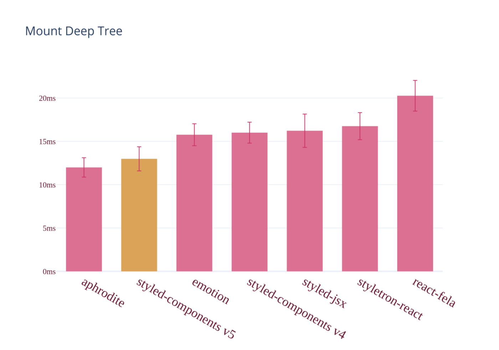
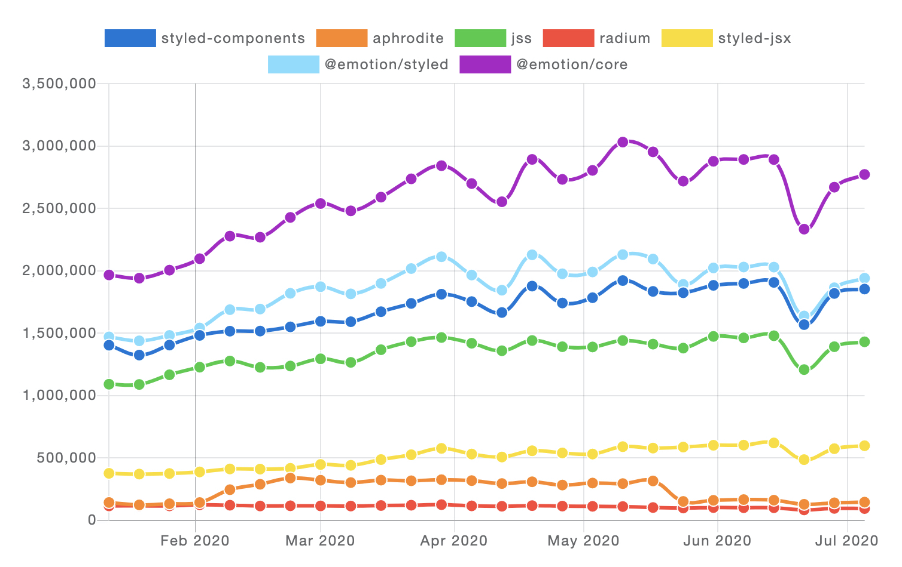

`Styled Components`는 리액트 앱에 스타일을 입히기 위한 도구입니다.

`Styled Components`라는 이름처럼 스타일이 입혀진 리액트 컴포넌트를 생성하는데 사용합니다.

종전의 방식처럼 리액트 컴포넌트에 특정한 클래스 이름을 부여하여
별도의 `CSS` 파일에 해당 클래스 이름을 `CSS Selector`를 통해 스타일링하는 방식이 아닌,
컴포넌트 자체를 `CSS`와 결합하여 생성할 수 있습니다.

```jsx
// CSS 코드와 함께 h1 요소를 렌더링하는 타이틀 컴포넌트를 생성하는 예.
const Title = styled.h1`
  font-size: 1.5em;
  text-align: center;
  color: palevioletred;
`;

// 역시 CSS 코드와 함께 section 요소를 렌더링하는 Wrapper 컴포넌트의 예.
const Wrapper = styled.section`
  padding: 4em;
  background: papayawhip;
`;

/*
위에서 생성한 타이틀 컴포넌트와 Wrapper 컴포넌트는 일반적인 리액트 컴포넌트와 동일하게 사용 가능합니다.
차이점이라면 컴포넌트 자체에 스타일링이 되어있느냐 없느냐의 차이일 뿐이죠.
*/
render(
  <Wrapper>
    <Title>Hello World!</Title>
  </Wrapper>,
);

// 발췌 : https://styled-components.com/docs/basics#getting-started
```

우리가 마치 `HTML 마크업`을 `JSX` 라는 것을 통해서 자바스크립트에서 직접 사용하듯이
(엄밀하게 말하자면 트랜스파일러를 통해 리액트 엘리먼트를 생성하는 일반 자바스크립트 코드로 변환을 하는 것이지만요)
`CSS`를 자바스크립트 코드 내에서 직접 작성하고 사용하는 방식을 `CSS in JS` 방식이라고 합니다.

컴포넌트 파일 내에서 직접 스타일 코드를 관리할 수 있기 때문에, 유지보수의 용이성을 갖는다고 합니다.
또한, `CSS Module`을 사용할 때 처럼 `BEM`과 같은 별도의 명명법을 사용하지 않고도 `클래스 이름 충돌`의 문제에서 벗어날 수 있습니다.

무엇보다도 컴포넌트 내에서 직접 `CSS`를 사용하기에 `props`를 활용하거나 Tagged Template Literal 안에서 자바스크립트 표현식을 활용해 좀 더 `Programmable`한 스타일링을 사용할 수 있다는 점이 큰 장점입니다.

```jsx
// props를 사용하는 버튼 컴포넌트의 예시.
const Button = styled.button`
  /* Adapt the colors based on primary prop */
  background: ${(props) => (props.primary ? 'palevioletred' : 'white')};
  color: ${(props) => (props.primary ? 'white' : 'palevioletred')};
  font-size: 1em;
  margin: 1em;
  padding: 0.25em 1em;
  border: 2px solid palevioletred;
  border-radius: 3px;
`;
render(
  <div>
    <Button>Normal</Button>
    <Button primary>Primary</Button>
  </div>,
);

// 발췌 : https://styled-components.com/docs/basics#adapting-based-on-props
```

## 다른 라이브러리들과의 비교

최신버전인 V5의 경우, `CSS in JS` 방식을 지원하는 다른 라이브러리들 보다 좋은 성능을 보여줍니다.

아래는 `Styled Components`가 제공한 공식 벤치마크 그래프입니다.

정확한 벤치마크의 내용은 알지 못 하나, 제목으로 유추해볼 때 깊은 트리(큰 트리라고 보시면 될 것 같습니다)를 리액트 앱에 마운팅할 때 소요되는 시간을 서로 비교한 것 같습니다.



[Aphrodite](https://github.com/Khan/aphrodite)가 가장 빠른 것으로 나타납니다만, 제가 가볍게 아프로디테를 살펴보았을 때는 그 인터페이스가 `Styled Components`에 비해 다소 불편해 보였습니다.

[emotion](https://emotion.sh/docs/introduction)은 사실 현시점 다운로드 수가 가장 많은 `CSS in JS` 라이브러리입니다.



리액트만을 위해 사용되는 라이브러리는 아니지만, Styled component(고유명사가 아닌 스타일이 결합된 컴포넌트를 의미)를 만들기 위한 `@emotion/styled` 라는 서브 모듈을 제공합니다.

`Styled Components` 와 거의 동일하다 싶을 정도로 동일한 API를 제공하는데, 위 그래프를 참고하였을 때 `Styled Components`가 성능상으로는 보다 이점이 있으니 `Styled Components`의 사용을 조금 더 고려해볼만할 것 같습니다.
